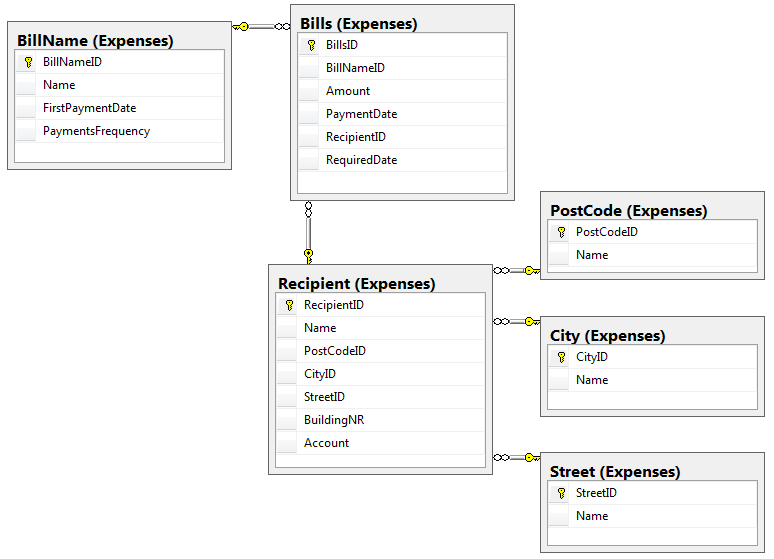

#WydatkiDomowe wersja Web

Tomasz Drzyzga
 
# 1) Użyte technologie
Aplikacja bazodanowa stworzona w Visual Studio 2015 .NET wersja 4.6.1 z wykorzystaniem:
- C#, 
- ASP.NET MVC 5, 
- Entity Framework 6.

Front-End:
- biblioteka Bootstrap,
- skrypty jQuery. 

Jako kontener DI zastosowano Ninject. W testach jednostkowych do utworzenia obiektów imitujących użyto bibliotekę Moq. 
Bazę danych utworzono w SQL Server 2014 następnie wykorzystano podejście code first from database.
# 2) Informacje podstawowe
Zadaniem programu jest ewidencja wydatków domowych, tworzenie raportów z wybranych okresów rozliczeniowych itp.
Schemat bazy wygląda następująco:

# 3) Funkcjonalność
Aplikacja umożliwia:
- ewidencja wydatków domowych
- tworzenie raportów za wybrany okres

# 4) Inne
Aplikacja w trakcie tworzenia.... Jej głownym celem jest nauka ASP.NET MVC 5, Entity Framework 6 oraz testów jednostkowych z wykorzystaniem biblioteki wbudowanej w Visual Studio.  

