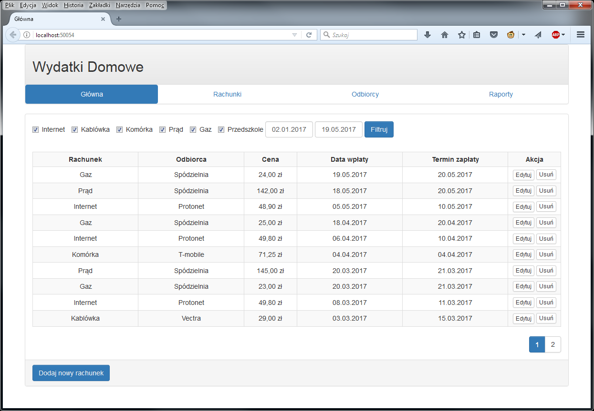
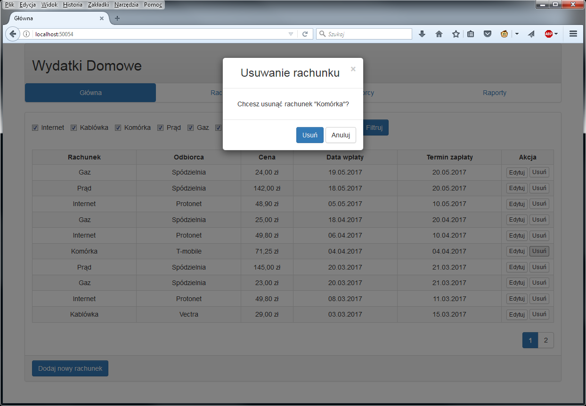
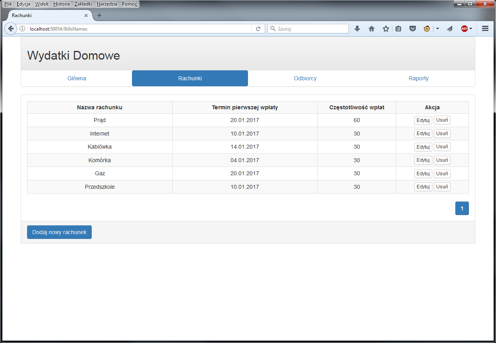
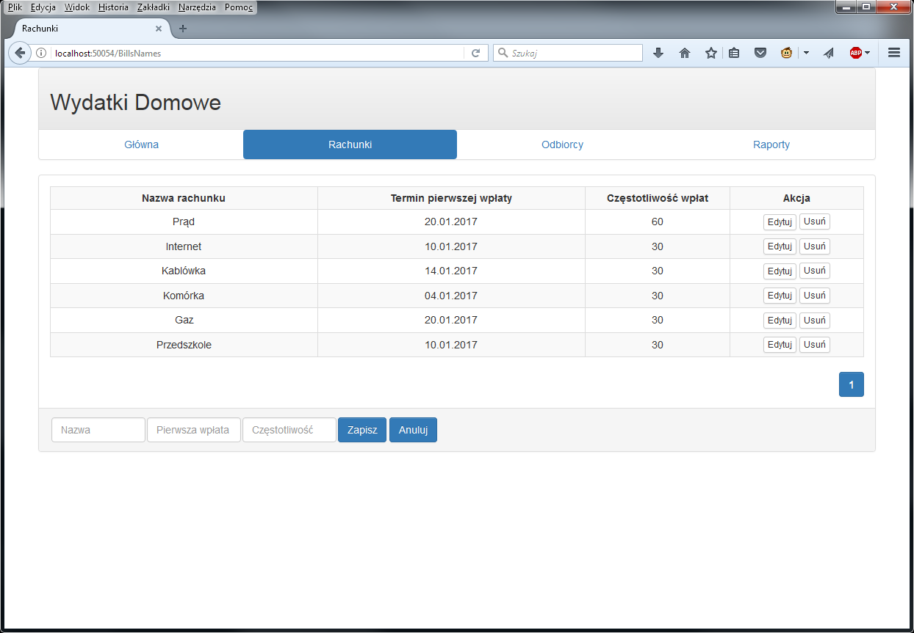
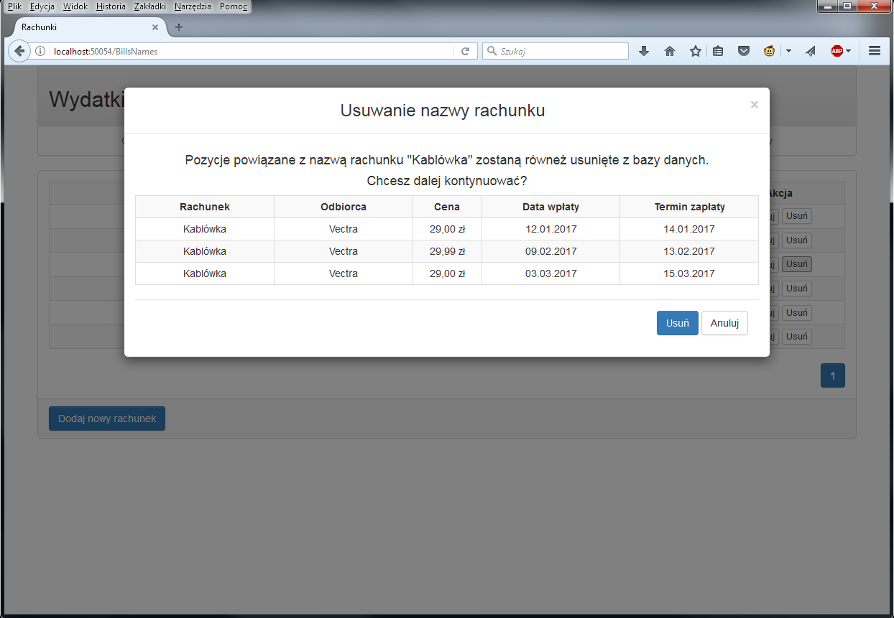
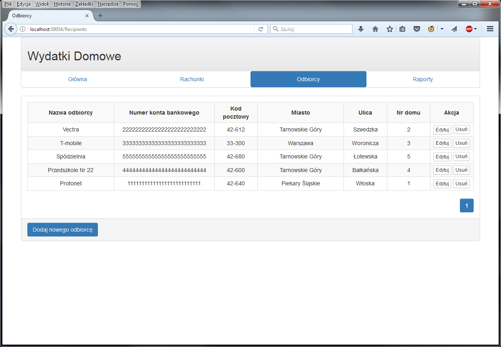
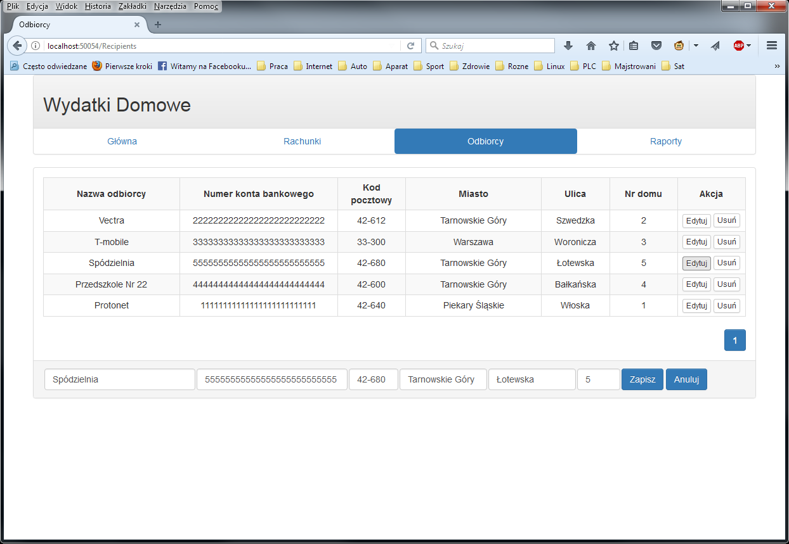
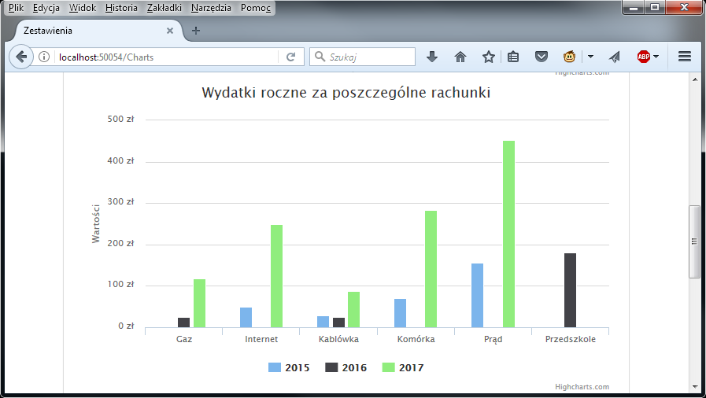

#WydatkiDomowe wersja Web

Tomasz Drzyzga
 
## 1) Użyte technologie
Aplikacja bazodanowa stworzona w Visual Studio 2015 .NET wersja 4.6.1 z wykorzystaniem:
- C#, 
- ASP.NET MVC 5, 
- Entity Framework 6.

Front-End:
- biblioteka Bootstrap,
- skrypty jQuery. 

Jako kontener DI zastosowano Ninject. W testach jednostkowych do utworzenia obiektów imitujących użyto bibliotekę Moq. 
Bazę danych utworzono w SQL Server 2014 następnie wykorzystano podejście code first from database.
## 2) Informacje podstawowe
Zadaniem programu jest ewidencja wydatków domowych, tworzenie raportów z wybranych okresów rozliczeniowych itp.
Schemat bazy wygląda następująco:

## 3) Funkcjonalność
Aplikacja umożliwia:
- ewidencja wydatków domowych
- tworzenie raportów za wybrany okres

## 4) Inne
Aplikacja w trakcie tworzenia.... Jej głownym celem jest nauka ASP.NET MVC 5, Entity Framework 6 oraz testów jednostkowych z wykorzystaniem biblioteki wbudowanej w Visual Studio.  

## 5) Postęp prac
Aktualnie (26.07.2017) aplikacja posiada następujące funkcjonalności:
#### a) Zakładka "Główna" zawiera zestawienie wszystkich zapłaconych rachunków. W zakładce tej można dodawać nowe rachunki, edytować      już istniejące oraz usuwać wpisy.

#### b) Zakładka "Rachunki" zawiera zestawienie nazw rachunków wraz z danymi potrzebnymi do ustalenia terminów płatności. W            zakładce tej można dodawać nowe nazwy rachunków, edytować już istniejące oraz usuwać wpisy.

#### c) Zakładka "Odbiorcy" zawiera zestawienie odbiorców rachunków wraz z takimi danymi jak nr konta bankowego oraz adres. W zakładce tej można dodawać nowe nazwych odbiorców, edytować już istniających oraz usuwać wpisy.

#### d) Zakładka "Zestawienia" zawiera raporty w formie wykresów. Gdzie mamy możliwość porównania wydaktów w danych miesiącach, wydaktów za poszczególne rachunki w roku jak i danym miesiącu.

